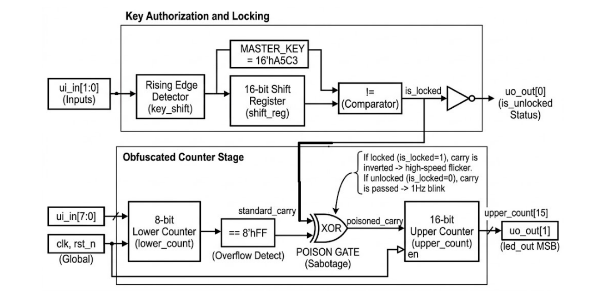

## How it works
The Carry-Chain Logic Lock is a hardware security primitive designed to protect chip functionality through timing-based obfuscation. 

The design is broken down into three main hardware modules:

+ **The Authorization Register (SIPO):** A 16-bit Serial-In Parallel-Out shift register. It uses a rising-edge detector on the `key_shift` input to synchronously sample the `key_data` bitstream.

+ **The Identity Comparator:** A 16-bit combinational equality block that continuously compares the current shift register value against a hardcoded Master Key (`16'hA5C3`). 

+ **The Obfuscated Counter Stage:** A 24-bit counter split into an 8-bit time-base and a 16-bit functional stage. An XOR gate intercepts the carry signal between these stages.
    - **Locked (Default/Incorrect Key):** The carry is inverted, forcing the functional stage to increment at an accelerated rate, resulting in a high-speed "scrambled" output.
    - **Unlocked:** The XOR gate becomes transparent, and the 16-bit stage increments normally to produce a stable 1 Hz pulse.

### Transient Behavior & Security
The output behavior is dynamic but remains corrupted until the authorization is complete. As bits are shifted in, the internal state changes, but the `blinker_output` will continue to flicker at high frequency as long as the register does not match the master key. This prevents side-channel analysis of "partial key matches."

## How to test
+ **Reset:** Press the system reset button (`rst_n` LOW). The `unlocked_led` (uo[0]) should be OFF, and `uo[1]` should show a high-frequency flicker.
+ **Key Entry:** Provide the 16-bit bitstream for `0xA5C3` on `ui[0]`. For each bit, pulse `key_shift` (`ui[1]`) HIGH.
+ **Verification:** Once the 16th correct bit is clocked in, `uo[0]` will turn HIGH, and `uo[1]` will immediately transition to a 1 Hz blink.
+ **Tamper Test:** Shifting in a single incorrect bit after unlocking will immediately re-lock the device and resume high-frequency obfuscation.

## External hardware
+ **Tiny Tapeout Demo Board.**
+ **Logic Analyzer/Oscilloscope:** Recommended to observe the frequency shift on `uo_out[1]`.
+ **Microcontroller:** To automate the 16-bit serial key entry via `ui_in[0]` and `ui_in[1]`.

